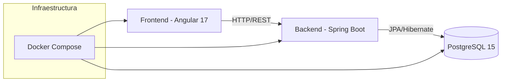

# 📘 Manual de Instalación y Uso

## ✅ Requisitos Previos
Antes de iniciar, asegúrate de tener instalado:

- **Java 17+** (para ejecutar Spring Boot).
- **Maven** (para compilar y manejar dependencias del backend).
- **Node.js 18+** (runtime del frontend).
- **Angular CLI 17** (para ejecutar y compilar el frontend).
- **Docker y Docker Compose** (para contenerización).
- **PostgreSQL 15**.
- **Git** (para clonar el repositorio).

---

## 🛠️ Tecnologías Utilizadas
- **Angular 17** (frontend).
- **Spring Boot** (backend).
- **PostgreSQL 15** (base de datos).
- **Docker y Docker Compose** (contenedores).
- **Node.js** (runtime y dependencias del frontend).
- **Maven** (gestión de dependencias en el backend).
- **Git** (control de versiones).
- **Angular Material (MatDialog)** (modales).
- **Lombok** (reducción de código boilerplate en el backend).
- **Hibernate / JPA** (persistencia de datos).

---

## ⚙️ Proceso de Instalación

1. **Clonar el repositorio**
   ```bash
   git clone <URL_REPOSITORIO>
   cd <NOMBRE_PROYECTO>
   ```

2. **Configurar el backend**  
   Editar el archivo `application.properties` en Spring Boot con la conexión a PostgreSQL (usuario/contraseña/URL).

3. **Instalar dependencias del backend**
   ```bash
   mvn clean install
   ```

4. **Instalar dependencias del frontend**
   ```bash
   cd frontend
   npm install
   ```

5. **Construir la(s) imagen(es) Docker**
   ```bash
   docker-compose build
   ```

6. **Levantar los servicios**
   ```bash
   docker-compose up
   ```

---

## 🚀 Uso del Sistema

- Frontend disponible en: **http://localhost:4200**  
- Backend disponible en: **http://localhost:8080**

### 🔑 Funcionalidades
- **Crear producto:** Agregar nombre, stock y precio.  
- **Actualizar producto:** Editar información existente.  
- **Eliminar producto:** Quitar un producto del inventario (con confirmación).  
- **Vender producto:** Abrir el modal, ingresar cantidad y confirmar; descuenta del stock.

---

## 📊 Arquitectura del Sistema



---

## 📌 Conclusión
Este sistema implementa un flujo completo de gestión de productos con **Angular 17** en el frontend, **Spring Boot** en el backend, base de datos en **PostgreSQL 15**, y orquestación con **Docker Compose**.  
Para más detalles técnicos, revisa el código fuente en este repositorio.
